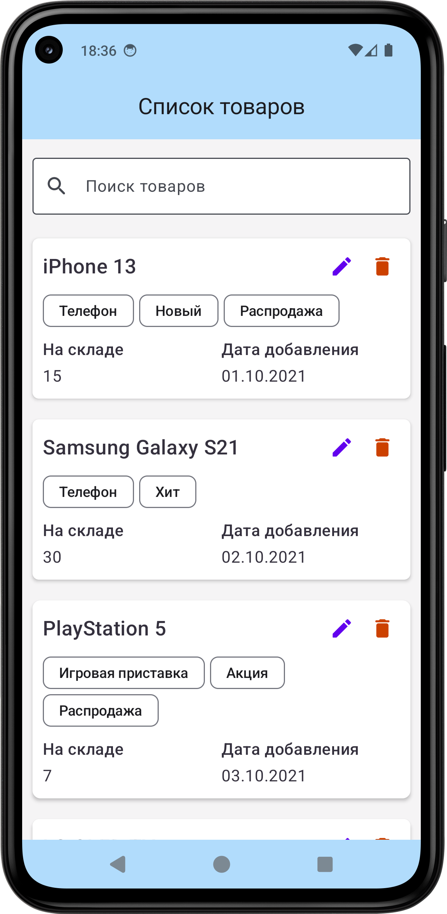
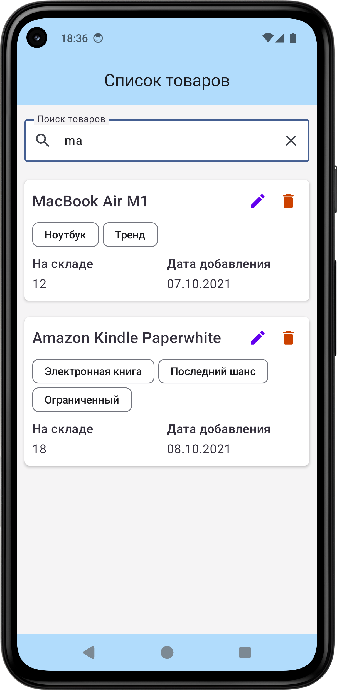
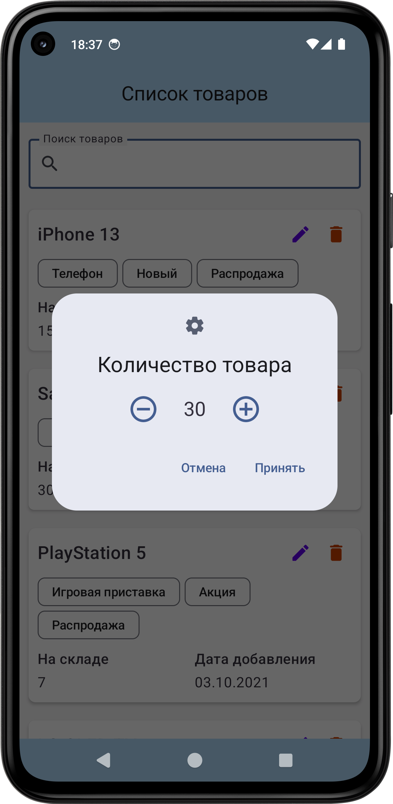
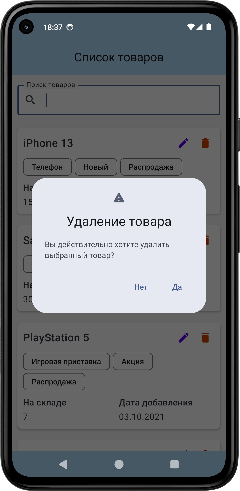

# Product Store
Product Store — это демонстрационное Android приложение  для просмотра, редактирования и удаления 
товаров в виде карточек с использованием Jetpack Compose и Room Database.

## Скриншоты




## Функционал
- Просмотр списка товаров: Отображение всех товаров в виде карточек.
- Поиск товаров по названию: Возможность искать товары по имени.
- Карточка товара: Каждая карточка отображает все поля из базы данных.
- Редактирование количества товара: Пользователь может изменять количество товара, изменения сохраняются в базе данных.
- Удаление товара: Удаление карточки товара из списка и базы данных.
- Теги товара: Теги отображаются в виде чипсов (Chips).

## Стек технологий:
- **Min SDK API – 23** — приложение поддерживает Android 6+
- **Kotlin v2.0.0+** — основной язык разработки
- **Kotlin Coroutines** — для работы с многопоточностью
- **MVI** — архитектурные паттерны для разделения данных, логики и UI
- **Jetpack Compose** - для работы с View
- **Room Database** - для локального хранения данных
- **Gradle Kotlin DSL + Version Catalog (TOML)** - для работы с системой сборки gradle
- **StateFlow / ViewModel** — для реактивного обновления UI
- **JUnit4, Robolectric, Mockk** - unit-тесты

## Установка и запуск:

### 1. Клонируйте репозиторий:
```bash
git clone https://github.com/realism-dev/productstore.git
```

### 2. Откройте проект в Android Studio:
В меню выберите File -> Open и выберите папку с клонированным проектом.

### 3. Синхронизируйте проект с Gradle:
После того как проект откроется, Android Studio предложит вам синхронизировать Gradle. Нажмите Sync Now.

### 4. Установите необходимые зависимости:
Проект использует несколько сторонних библиотек, указанных в файле build.gradle. Все они будут автоматически загружены при синхронизации Gradle.

### 5. Запуск приложения:
Подключите Android-устройство или запустите эмулятор.
Нажмите Run в Android Studio.

## Установка из .apk файла:
В корень репозитория выложено скомпилированное production приложение ip-test-task.apk.
[Скачайте](https://github.com/realism-dev/ProductStore/blob/master/ip-test-task.apk) и установите на свой android-смартфон.

## [MIT License](https://github.com/realism-dev/ProductStore/blob/master/LICENSE)
